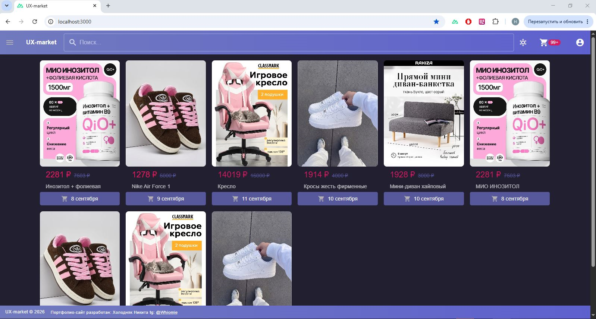
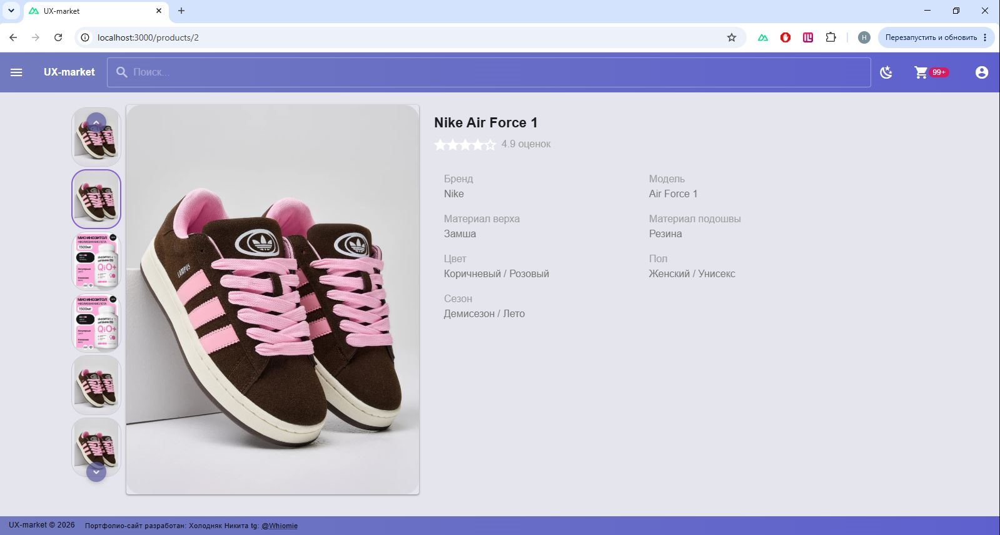
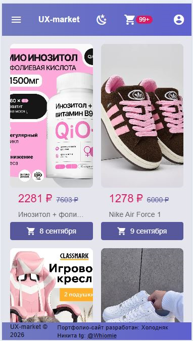

<div align="center">

# 🛒 UX-Market — интернет-магазин на Nuxt + Vuetify + NestJS

**Современный e-commerce проект с адаптивным дизайном, быстрой производительностью и чистым кодом.**

[](https://nuxt.com)
[](https://vuejs.org)
[](https://vuetifyjs.com)
[](https://www.typescriptlang.org)
[](https://pinia.vuejs.org)
[](https://nestjs.com)

**Автор:** Холодняк Никита · **Telegram:** [@Whiomie](https://t.me/Whiomie)

[](https://t.me/Whiomie)

> ⚠️ **Внимание!** Это проект-портфолио, поэтому фронтенд и бэкенд находятся в одном репозитории. В боевых проектах их обычно разделяют.

</div>

---

## 📋 О проекте

**UX-Market** — полнофункциональный интернет-магазин, разработанный для демонстрации навыков fullstack-разработки.

- 🛒 Каталог товаров с фильтрацией и поиском
- 📦 Страница товара с галереей изображений
- 🧺 Корзина с сохранением состояния между сессиями
- 📇 Страница контактов
- 🎨 Кастомная тема (светлая / тёмная)
- 📱 Полная адаптивность (mobile-first)
- ⚡ Оптимизированная производительность (SSR)
- 🔐 JWT-аутентификация _(в разработке)_
- 🗄️ REST API на NestJS

Находится в активной разработке в качестве портфолио.

---

## 📸 Скриншоты

### 🖥️ Десктоп

| Раздел          | Светлая тема                                                                     | Тёмная тема                                                                    |
| --------------- | -------------------------------------------------------------------------------- | ------------------------------------------------------------------------------ |
| Главная         |  |  |
| Карточка товара |  |  |
| Корзина         |          |          |
| Контакты        |     |     |

### 📱 Мобильная версия

| Раздел          | Светлая тема                                                                                        | Тёмная тема                                                                                       |
| --------------- | --------------------------------------------------------------------------------------------------- | ------------------------------------------------------------------------------------------------- |
| Главная         |          |          |
| Карточка товара |  |  |
| Корзина         |          |          |
| Контакты        |     |     |

---

## 🛠️ Технологии

| Технология                  | Назначение                          |
| --------------------------- | ----------------------------------- |
| **Nuxt 3**                  | SSR-фреймворк, роутинг, оптимизация |
| **Vue 3 (Composition API)** | Реактивность, компонентный подход   |
| **Vuetify 3**               | UI-компоненты, темизация            |
| **TypeScript**              | Строгая типизация                   |
| **Pinia**                   | Управление состоянием               |
| **SCSS**                    | Стилизация, переменные              |
| **Vite**                    | Сборка, dev-сервер                  |
| **NestJS**                  | Backend-фреймворк                   |
| **PostgreSQL**              | База данных                         |
| **Docker**                  | Контейнеризация                     |

---

## ✨ Фичи

- ✅ **Кастомная тема** — светлая / тёмная, настраиваемые цвета
- ✅ **Поиск по товарам** с debounce
- ✅ **Страница товара** — адаптивная галерея, миниатюры, главное изображение
- ✅ **Корзина** — добавление, изменение количества, удаление, сохранение в `localStorage`
- ✅ **Страница контактов** — контактные данные и информация о разработчике
- ✅ **Обработка загрузки** — скелетоны, лоадеры, плейсхолдеры
- ✅ **Чистая архитектура** — компоненты, composables, stores

---

## 🚧 Планы по развитию

- [x] Поиск по товарам
- [x] Страница корзины
- [x] Страница контактов
- [ ] Умный переход по каталогу и странице текущей карточки
- [х] Боковая панель (навигация)

---

## 🖥️ Установка и запуск

### Требования

- Node.js ≥ 18
- Yarn ≥ 1.22
- Docker Desktop (для БД)

### Команды

```bash
# 1. Клонировать репозиторий
git clone https://github.com/your-username/ux-market.git
cd ux-market

# 2. Установить зависимости (frontend + backend)
yarn install

# 3. Запустить всё
yarn start      # поднять PostgreSQL в Docker
yarn front      # запустить фронтенд
yarn back       # запустить бэкенд
```

После запуска:

- Frontend — http://localhost:3000
- Backend — http://localhost:5000
- PostgreSQL — http://localhost:5432

---

## 📄 Лицензия

Проект создан в учебных и портфолио-целях.
