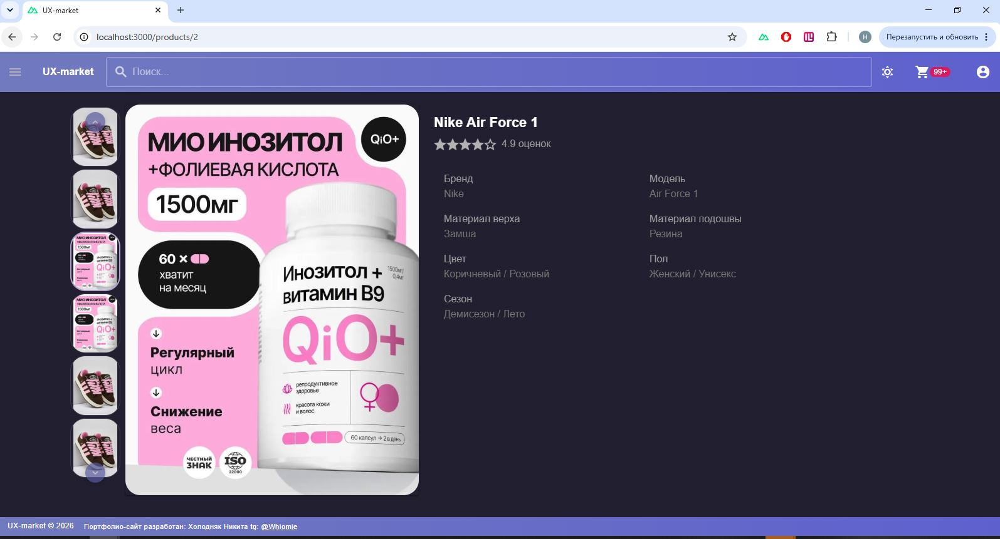

<div align="center">

# 🛒 UX-Market — Интернет-магазин на Nuxt + Vuetify + Nest

**Современный e-commerce проект с адаптивным дизайном, быстрой производительностью и чистым кодом.**

[](https://nuxt.com)
[](https://vuejs.org)
[](https://vuetifyjs.com)
[](https://www.typescriptlang.org)
[](https://pinia.vuejs.org)
[](https://nestjs.com)

**Автор:** Холодняк Никита

**Telegram:** [@Whiomie](https://t.me/Whiomie)

[](https://t.me/Whiomie)

> ⚠️ **Внимание!** Это проект-портфолио, поэтому фронтенд и бэкенд находятся в одном репозитории. В боевых проектах их обычно разделяют.

</div>

---

## 📸 Скриншоты

<div align="center">

### 🖥️ Десктопная версия

#### Светлая тема


#### Тёмная тема


### 🛍️ Страница товара

#### Светлая тема


#### Тёмная тема




### 📱 Мобильная версия

#### Светлая тема


#### Тёмная тема


### 🛍️ Страница товара (мобильная)

#### Светлая тема


#### Тёмная тема


</div>

---

## 📋 О проекте

**UX-Market** — это полнофункциональный интернет-магазин, разработанный для демонстрации навыков fullstack-разработки. Проект включает в себя:

- 🛒 Каталог товаров с фильтрацией и поиском
- 📦 Страница товара с галереей изображений
- 🎨 Кастомная тема (светлая/тёмная)
- 📱 Полная адаптивность (mobile-first)
- ⚡ Оптимизированная производительность (SSR)
- 🔐 JWT-аутентификация (в разработке)
- 🗄️ REST API на NestJS

Находится в активной разработке в качестве портфолио.

---

## 🛠️ Технологии

| Технология | Назначение |
|------------|------------|
| **Nuxt** | SSR-фреймворк, роутинг, оптимизация |
| **Vue 3 (Composition API)** | Реактивность, компонентный подход |
| **Vuetify** | UI-компоненты, темизация |
| **TypeScript** | Строгая типизация |
| **Pinia** | Управление состоянием |
| **SCSS** | Стилизация, переменные |
| **Vite** | Сборка, dev-сервер |
| **NestJS** | Backend-фреймворк |

---

## ✨ Основные фичи

- ✅ **Кастомная тема** — светлая/тёмная, настраиваемые цвета
- ✅ **Адаптивная галерея** — миниатюры + главное изображение
- ✅ **Обработка загрузки** — скелетоны, лоадеры, плейсхолдеры
- ✅ **Локальное хранилище** — сохранение состояния между сессиями
- ✅ **Чистая архитектура** — компоненты, composables, stores

---

## 🚧 Планы по развитию

- [✅] Поиск по товарам
- [ ] Умный переход по каталогу и странице текущей карточки
- [ ] Боковая панель
- [ ] Страница корзины

---

## 🖥️ Установка и запуск

```bash
# 1. Клонировать репозиторий
git clone https://github.com/your-username/ux-market.git

# 2. Перейти в папку проекта
cd ux-market

# 3. Установить зависимости
npm install

# 4. Запустить dev-сервер
npm run dev

# 5. Открыть в браузере
# http://localhost:3000