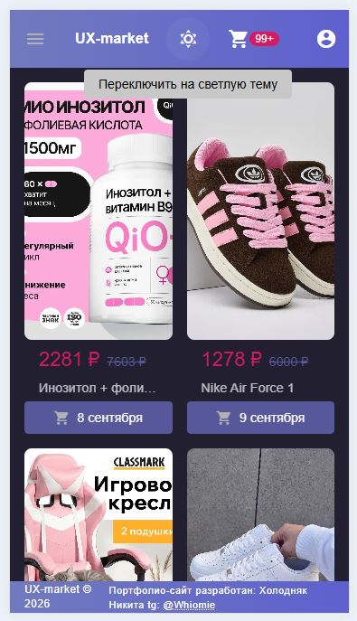

<div align="center">

# 🛒 UX-Market — Интернет-магазин на Nuxt 3 + Vuetify 3

**Современный e-commerce проект с адаптивным дизайном, быстрой производительностью и чистым кодом.**

[](https://nuxt.com)
[](https://vuejs.org)
[](https://vuetifyjs.com)
[](https://www.typescriptlang.org)
[](https://pinia.vuejs.org)

</div>

---

## 📸 Скриншоты

<div align="center">

### 🖥️ Десктопная версия

#### Светлая


#### Темная


### 🛍️ Страница товара

#### Светлая


#### Темная


### 🖥️ Мобильная версия

#### Светлая


#### Темная



### 🛍️ Страница товара

#### Светлая


#### Темная


</div>

---

## 🚀 Демо

[🔗 Открыть живое демо](https://your-demo-link.com)

---

## 📋 О проекте

**UX-Market** — это полнофункциональный интернет-магазин, разработанный для демонстрации навыков frontend-разработки. Проект включает в себя:

- 🛒 Каталог товаров с фильтрацией и поиском
- 📦 Страница товара с галереей изображений
- 🎨 Кастомная тема (light/dark)
- 📱 Полная адаптивность (mobile-first)
- ⚡ Оптимизированная производительность (SSR)

---

## 🛠️ Технологии

| Технология                  | Назначение                |
| --------------------------- | ------------------------- |
| **Nuxt 3**                  | SSR, роутинг, оптимизация |
| **Vue 3 (Composition API)** | Реактивность, компоненты  |
| **Vuetify 3**               | UI-компоненты, темизация  |
| **TypeScript**              | Строгая типизация         |
| **Pinia**                   | Управление состоянием     |
| **SCSS**                    | Стилизация, переменные    |
| **Vite**                    | Сборка, dev-сервер        |

---

## ✨ Основные фичи

- ✅ **Кастомная тема** — светлая/тёмная, настраиваемые цвета
- ✅ **Адаптивная галерея** — миниатюры + главное изображение
- ✅ **Обработка загрузки** — скелетоны, лоадеры, плейсхолдеры
- ✅ **Локальное хранилище** — сохранение состояния между сессиями
- ✅ **Чистая архитектура** — компоненты, composables, stores

---

## 🖥️ Установка и запуск

```bash
# 1. Клонировать репозиторий
git clone https://github.com/your-username/ux-market.git

# 2. Перейти в папку проекта
cd ux-market

# 3. Установить зависимости
npm install

# 4. Запустить dev-сервер
npm run start

# 5. Открыть в браузере
# http://localhost:3000
```
